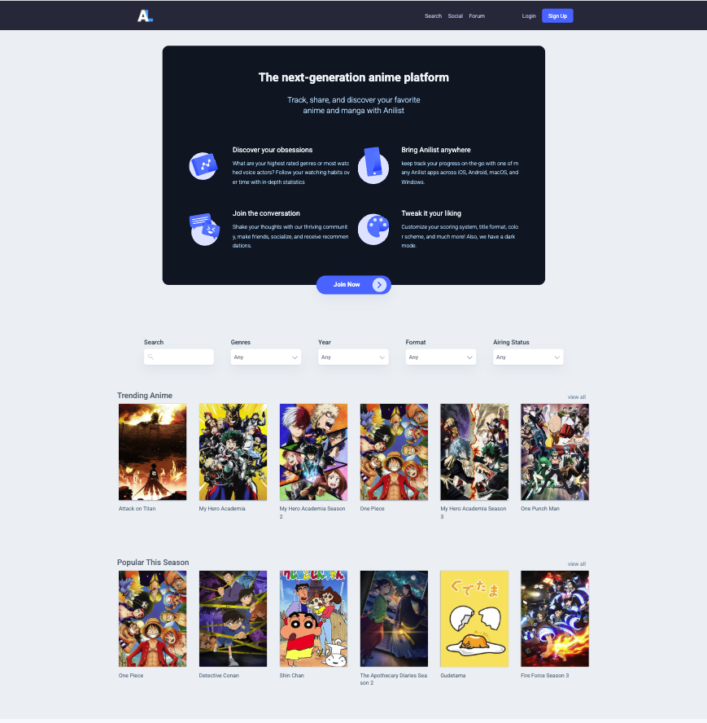
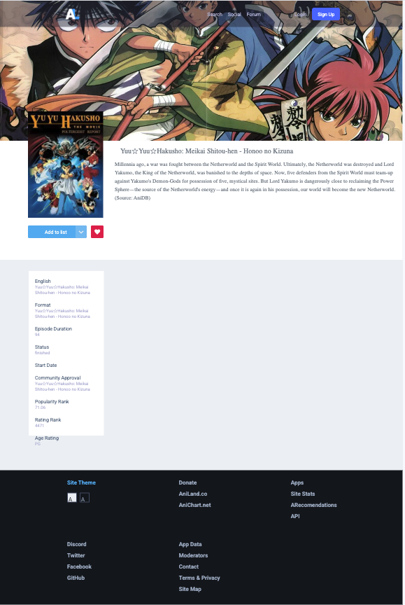
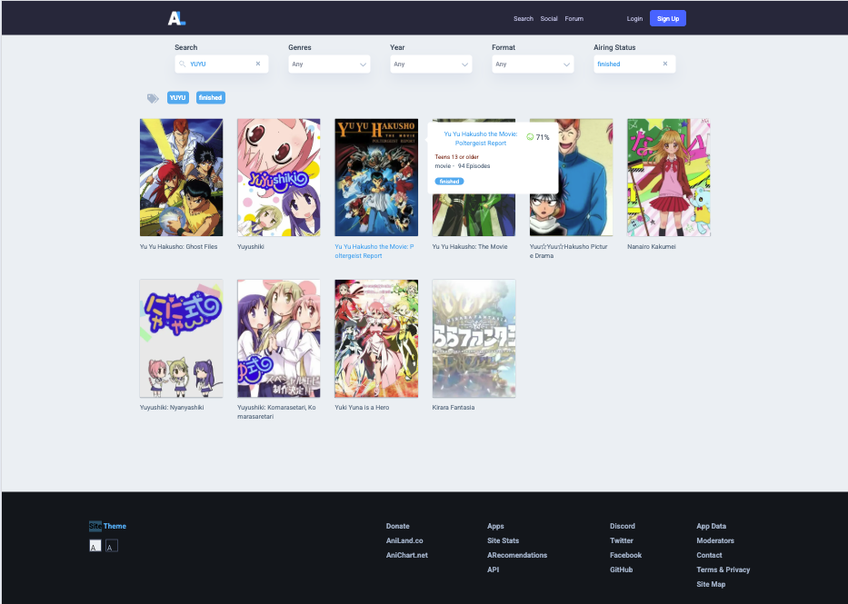

<h1>Aniland</h1>

<h3>Description</h3>

Aniland is a personal side project built with [React](https://reactjs.org/) and the Context API, inspired by the anime community platform [AniList](https://anilist.co/). The goal is to showcase modern React development practices and frontend skills.

👉 [Live Demo](https://aniland.vercel.app/)


<h2 id="layout">🎨 Layout</h2>

<p align="center">
  <figure style="display:inline-block; margin:10px;">
    
    <figcaption align="center"><strong>Home Page</strong></figcaption>
  </figure>
  <figure style="display:inline-block; margin:10px;">
    
    <figcaption align="center"><strong>Single Anime View</strong></figcaption>
  </figure>
  <figure style="display:inline-block; margin:10px;">
    
    <figcaption align="center"><strong>Search Results</strong></figcaption>
  </figure>
</p>

---

## Getting Started

To run the project locally:
```bash
npm install
npm run dev
```

Then open http://localhost:3000 in your browser.


<h2>Technical Notes</h2>

This project uses features like custom hooks and Context API for state management. The layout was built with Tailwind CSS and some features were applied with Material UI.

<h2>Areas for Improvement</h2>

One area I believe could be improved is the overall architectural design pattern. 
Since the project was built entirely from scratch, some structural compromises were inevitable. 
Also, some data fetching isn’t optimized. For example, the Home Page makes extra requests even though the data is already stored on Context, which doesn’t scale well.
